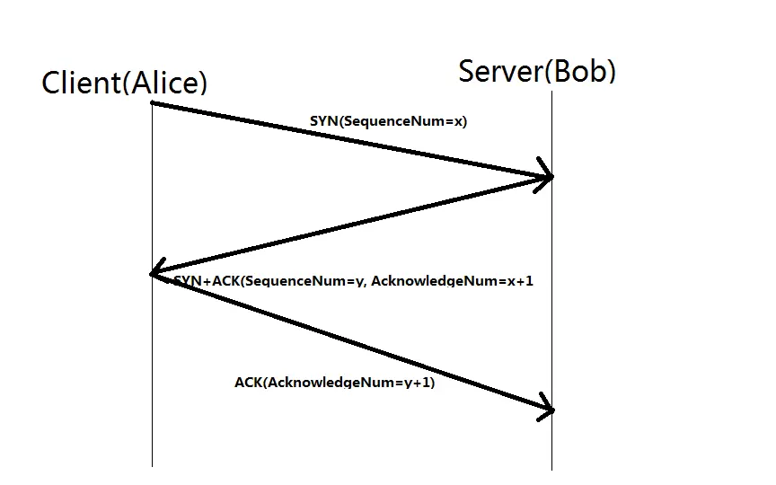
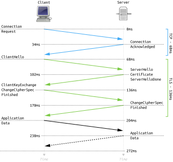
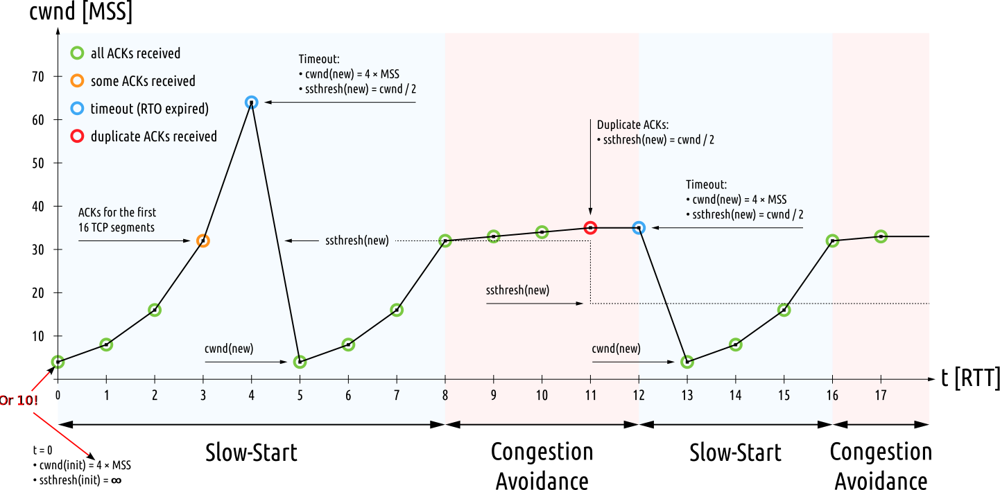
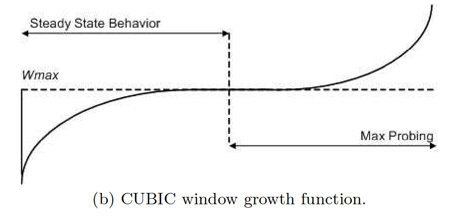
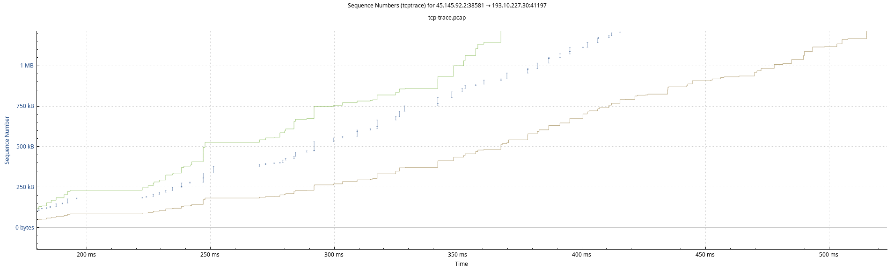
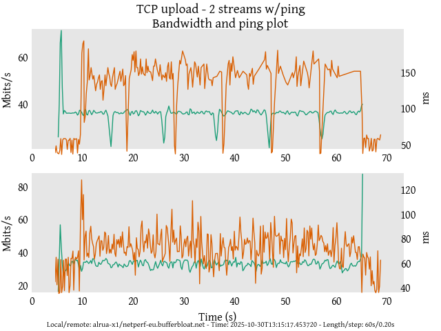
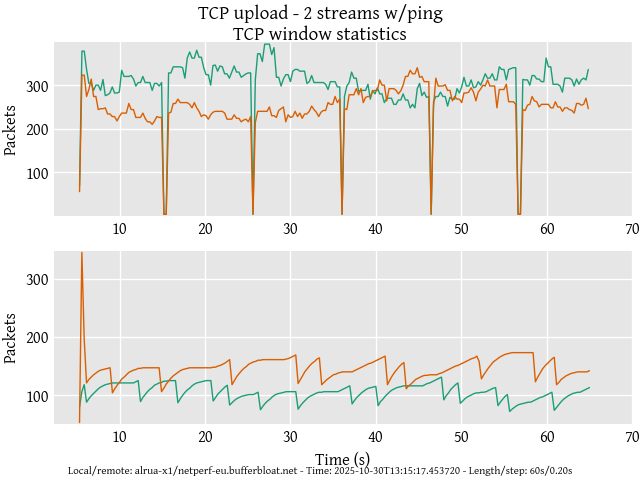

# -*- fill-column: 79; -*-
#+TITLE: TCP in (way too much) detail
#+AUTHOR: Toke Høiland-Jørgensen <toke@redhat.com>
#+EMAIL: toke@redhat.com
#+REVEAL_THEME: white
#+REVEAL_TRANS: linear
#+REVEAL_MARGIN: 0
#+REVEAL_ROOT: ../reveal.js
#+REVEAL_EXTRA_CSS: custom.css
#+OPTIONS: reveal_center:t reveal_control:t reveal_history:nil
#+OPTIONS: reveal_width:1600 reveal_height:900 reveal_pdfseparatefragments:nil
#+OPTIONS: ^:nil tags:nil toc:nil num:nil ':t

* Outline / ideas                                                  :noexport:
- Handshake (SYN/SYN-ACK/ACK-sekvens)
- Slow start
- Congestion avoidance
- De mest almindelige congestion control-algoritmer:
        - Reno
        - CUBIC
               - BBR
- Loss recovery-mekanismer:
        - Basis (dup-ack + retransmit timer)
              - SACK
- Interaktion med andre lag:
              - Latency, jitter og bufferbloat
              - Reordering / HOL blocking
- Testværktøjer:
              - Netperf/iperf

* Agenda                                                             :export:

- Connection startup
- Loss recovery mechanisms
- Congestion control
- Interactions with other parts of the network
- Measurement tools and techniques
- Bonus: TCP Zero Copy

** TCP conceptually

- Connection oriented
  - Have to =connect()= before transmitting

- Byte stream based
  - Chopping data into packets is a protocol detail

- Reliable
  - Data will (eventually) arrive in order, or error out

- Adaptable
  - Will attempt to transmit data as fast as possible over any link

- Old
  - [[https://www.rfc-editor.org/rfc/rfc675][RFC675]] was first published 51 years ago - lots has happened since!

* Connection startup                                                 :export:

** TCP handshake
:PROPERTIES:
:reveal_extra_attr: class="img-slide"
:END:

#+ATTR_html: :style height: 700px;
[[file:Handshake-1.webp]]

** TCP handshake
:PROPERTIES:
:reveal_extra_attr: class="img-slide"
:END:

#+ATTR_html: :style height: 700px;
[[file:Handshake-2.webp]]

** TCP handshake
:PROPERTIES:
:reveal_extra_attr: class="img-slide"
:END:

#+CAPTION: Image source: https://en.wikipedia.org/wiki/Handshake_(computing)
#+ATTR_html: :style height: 700px;

** Adding TLS
:PROPERTIES:
:reveal_extra_attr: class="img-slide"
:END:

#+ATTR_html: :style height: 700px;
#+CAPTION: Image source: https://en.wikipedia.org/wiki/Transport_Layer_Security#TLS_handshake

** Important points - connection startup

- Small packets
- Multiple round-trips to setup a connection
- Dominated by RTT
- Can take longer than the data transfer!

* TCP loss recovery                                                  :export:

** Retransmission timeout (RTO)
#+ATTR_html: :style height: 700px;
[[file:rto.svg]]

** Fast retransmit (DupACK)

#+ATTR_html: :style height: 700px;

** Selective Acknowledgement (SACK and DSACK)

- SACK: [[https://datatracker.ietf.org/doc/rfc2018/][RFC2018]]
- DSACK: [[https://datatracker.ietf.org/doc/rfc2883/][RFC2883]]

#+ATTR_html: :style height: 600px;

** Tail Loss Probes (TLP)
#+ATTR_html: :style height: 650px;

Shorter timeout, don't reduce window

** Recent Acknowledgement (RACK)

- [[https://datatracker.ietf.org/doc/rfc8985/][RFC8985]]
- Keep a "recent window" based on RTT (=rtt_min/4=)
- Don't trigger loss recovery if OOO packets arrive within this window
- Significantly improves behaviour when the network reorders packets

** Important points - loss recovery

- Several different mechanisms in play
- SACK, RACK and TLP improves behaviour
  - Reordering resilience in particular
- Active research and innovation - moving target!

* Congestion control                                                 :export:
Congestion control determine TCP behaviour. We'll cover:

- Classic (Reno) TCP
- CUBIC
- BBR

[[https://en.wikipedia.org/wiki/TCP_congestion_control#Algorithms][Wikipedia has a list of other algorithms]]

** Congestion signals
All congestion control algorithms react to one or more signals:

- Packet loss (duplicate ACKs)
- Timeout (RTO)
- ECN notification
- RTT increases

** "Slow" start in classic (Reno) TCP
:PROPERTIES:
:reveal_extra_attr: class="img-slide"
:END:

#+ATTR_html: :style height: 650px;
#+CAPTION: Image source: =https://commons.wikimedia.org/wiki/File:TCP_Slow-Start_and_Congestion_Avoidance.svg=

Many flows never leave slow start!

** TCP CUBIC

- [[https://www.rfc-editor.org/rfc/rfc9438.html][RFC9438]]
- Default in Linux, MacOSX and Windows 10+
- More aggressive than RENO
- But still fundamentally loss based

** Congestion signals (CUBIC)

- *Packet loss (duplicate ACKs)*
- *Timeout (RTO)*
- *ECN notification*
- RTT increases

** TCP CUBIC window function

#+ATTR_html: :style height: 700px;
#+CAPTION: Image source: https://www.cs.princeton.edu/courses/archive/fall16/cos561/papers/Cubic08.pdf

** TCP BBR

- [[https://queue.acm.org/detail.cfm?id=3022184][First published]] in 2016
- [[https://datatracker.ietf.org/doc/draft-ietf-ccwg-bbr/][draft-ietf-ccwg-bbr]] (WiP) at the IETF
- Based on /modelling link behaviour/
- Used extensively at Google (e.g., YouTube)
- Multiple versions (v1, v2, v3), only v1 in Linux

** Congestion signals (BBRv1)

- Packet loss (duplicate ACKs)
- *Timeout (RTO)*
- ECN notification
- *RTT increases*

** Congestion signals (BBRv3)

- *Packet loss (duplicate ACKs)*
- *Timeout (RTO)*
- *ECN notification*
- *RTT increases*

** TCP BBR behaviour
#+ATTR_html: :style height: 700px;
#+CAPTION: Image source: https://queue.acm.org/detail.cfm?id=3022184
[[file:vanjacobson2.webp]]

** Important points - congestion control

- "Classic" (New) Reno often implicit assumption in literature
- CUBIC actually default, and is more aggressive
- BBR totally different, mainly deployed in the cloud (Google)

#+begin_src
  $ sysctl -a | grep congestion
  net.ipv4.tcp_allowed_congestion_control = reno cubic bbr
  net.ipv4.tcp_available_congestion_control = reno cubic bbr
  net.ipv4.tcp_congestion_control = bbr
#+end_src

* TCP interactions                                                   :export:

** Latency
#+HTML: 

#+ATTR_html: :style width: 100%;
[[file:plt-bandwidth.png]]

#+ATTR_html: :style width: 100%;
[[file:plt-latency.png]]

#+HTML: 

Source: https://youtu.be/TNBkxA313kk (from 2011)
#+HTML: 

** Bufferbloat

#+ATTR_html: :style height: 700px;
[[file:bloat-graph.png]]

*** Bufferbloat (cont)

- Loss (or ECN mark) is an important signal for TCP!
- Timely signalling required or TCP will keep scaling up
- Active Queue Management (AQM) and Fairness Queueing (FQ) helps
- Excessive link-layer retries add latency

** Head of line (HOL) blocking

#+ATTR_html: :style height: 650px;

Also happens when 2 is reordered, not lost.

** TCP hardware offload

We assume traffic is smooth, but:

- Servers use TCP Segmentation Offload (TSO)
- Network stack creates 64KB superpacket, NIC segments
- These go out at line rate (10-100G) as one burst!
- Can overwhelm smaller links downstream

** TCP Pacing
- Linux feature that spreads out packets over an RTT
- /Reduces/ burstiness by spacing packets
- Helps reduce buffering
- Can hurt aggregation at wireless links

** Important points - TCP interactions

- TCP interacts with other layers in non-obvious ways
- Latency equally import as throughput
- Congestion signalling is important!
  - TCP will fill buffers, leading to bloat
- Hardware offloads and pacing can affect packet sequences

* Measurement tools and techniques                                   :export:

** Measurement tool overview
#+HTML: 

*Basic throughput tests*
- [[https://sourceforge.net/projects/iperf2/][iperf2]] / [[https://software.es.net/iperf/][iperf3]]
- [[https://github.com/HewlettPackard/netperf][netperf]]
- [[https://uperf.org/][uperf]]

*Latency (under load!)*
- =ping=
- [[https://fping.org/][fping]]
- [[https://github.com/heistp/irtt][irtt]]
- [[https://oss.oetiker.ch/smokeping/][smokeping]]
- [[https://github.com/xdp-project/bpf-examples/tree/main/pping][Passive ping]]

*Application-level tests*
- [[https://github.com/tohojo/http-getter/][http-getter]]
- [[https://github.com/hatoo/oha][oha]]

#+HTML: 

 *TCP flow and state analysis*
- [[https://www.wireshark.org/][Wireshark]]
- [[https://sourceforge.net/projects/open-tcptrace/][TCPtrace]]
- =ss= utility

*Public speedtests*
- [[https://www.waveform.com/tools/bufferbloat][Waveform]]
- [[https://speed.cloudflare.com/][Cloudflare]]
- [[https://speedtest.net/][speedtest.net]]
- [[https://fast.com/][fast.com]]

*Integrated test tools*
- [[https://flent.org][Flent]]
- [[https://github.com/cloudflare/bbperf][bbperf]]

#+HTML: 

*** ss TCP stats

#+begin_src
  $ ss -ntip | grep -A 1 netperf
  ESTAB 0      0        10.42.18.12:45497        193.10.227.30:12865 users:(("netperf",pid=1593163,fd=3))
  	bbr wscale:7,10 rto:265 rtt:64.873/29.682 ato:40 mss:1288 pmtu:1420 rcvmss:656 advmss:1368
          cwnd:11 bytes_sent:656 bytes_acked:657 bytes_received:656 segs_out:4 segs_in:3 data_segs_out:1
          data_segs_in:1 bbr:(bw:209424bps,mrtt:49.089,pacing_gain:2.88672,cwnd_gain:2.88672)
          send 1747168bps lastsnd:1206 lastrcv:1157 lastack:1157 pacing_rate 4386232bps
          delivery_rate 209904bps delivered:2 app_limited busy:49ms reordering:4 rcv_space:13312
          rcv_ssthresh:13312 minrtt:49.089 snd_wnd:64512 rcv_wnd:65536
  --
  ESTAB 0      3776416  10.42.18.12:45271        193.10.227.30:41287 users:(("netperf",pid=1593163,fd=4))
  	bbr wscale:7,10 rto:382 rtt:181.719/6.64 mss:1288 pmtu:1420 rcvmss:536 advmss:1368 cwnd:624
          bytes_sent:4792648 bytes_acked:3988937 segs_out:3723 segs_in:1044 data_segs_out:3721
          bbr:(bw:43716968bps,mrtt:38.541,pacing_gain:2.88672,cwnd_gain:2.88672) send 35382629bps
          lastsnd:1 lastrcv:1119 lastack:1 pacing_rate 124936600bps delivery_rate 33778600bps
          delivered:3098 delivered_ce:2649 busy:1119ms unacked:624 reordering:4 rcv_space:13680
          rcv_ssthresh:64168 notsent:2972704 minrtt:38.541 snd_wnd:3144192 rcv_wnd:65536

#+end_src

*** tcptrace example
#+begin_src
  $ sudo tcpdump -epni wg0 -s 128 -w tcp-trace.pcap host netperf-eu.bufferbloat.net
  # run test and exit with Ctrl-C afterwards
  tcpdump: listening on wg0, link-type RAW (Raw IP), snapshot length 128 bytes
  ^C5856 packets captured
  5862 packets received by filter
  0 packets dropped by kernel

  $ tcptrace -G tcp-trace.pcap
  1 arg remaining, starting with 'tcp-trace.pcap'
  Ostermann's tcptrace -- version 6.6.7 -- Thu Nov  4, 2004

  TCP packet 1: reserved bits are not all zero.
  	Further warnings disabled, use '-w' for more info
  5856 packets seen, 5856 TCP packets traced
  elapsed wallclock time: 0:00:00.062305, 93989 pkts/sec analyzed
  trace file elapsed time: 0:00:05.517782
  TCP connection info:
    1: alrua-x1:52789 - 193.10.227.30:12865 (a2b)    7>    5<  (complete)
    2: alrua-x1:38581 - 193.10.227.30:41197 (c2d) 1298> 4546<  (complete)
  $ xplot c2d_tsg.xpl
  # interactive viewer
#+end_src

*** wireshark example
#+begin_src
  $ wireshark tcp-trace.png
  Statistics -> TCP Stream Graphs -> Time sequence (tcptrace)
#+end_src

#+ATTR_html: :style height: 700px;

*** Flent basic example
#+begin_src 
$ flent tcp_2up netperf-eu.bufferbloat.net --socket-stats
Starting Flent 2.2.0 using Python 3.13.7.
Starting tcp_2up test. Expected run time: 70 seconds.
Data file written to ./tcp_2up-2025-10-30T131517.453720.flent.gz

Summary of tcp_2up test run from 2025-10-30 13:15:17

                                               avg       median       99th %          # data pts
 Ping (ms) ICMP                     :       123.28       142.00       181.28 ms              237
 TCP upload avg                     :        17.69          N/A          N/A Mbits/s         350
 TCP upload sum                     :        35.38          N/A          N/A Mbits/s         350
 TCP upload::1                      :        19.34        20.23        24.48 Mbits/s         350
 TCP upload::1::tcp_bbr_bw          :        22.33        22.61        28.29                 217
 TCP upload::1::tcp_bbr_cwnd_gain   :         1.99         2.00         2.89                 217
 TCP upload::1::tcp_bbr_mrtt        :        43.90        42.53        45.97                 217
 TCP upload::1::tcp_bbr_pacing_gain :         1.03         1.00         2.62                 217
 TCP upload::1::tcp_cwnd            :       300.49       308.00       392.64                 218
 TCP upload::1::tcp_delivery_rate   :        19.26        19.37        23.22                 218
 TCP upload::1::tcp_pacing_rate     :        22.67        22.58        29.48                 218
 TCP upload::1::tcp_rtt             :       144.11       146.85       173.39                 217
 TCP upload::1::tcp_rtt_var         :         3.51         2.64        15.10                 217
 TCP upload::2                      :        16.04        16.35        21.36 Mbits/s         350
 TCP upload::2::tcp_bbr_bw          :        18.47        18.24        22.39                 218
 TCP upload::2::tcp_bbr_cwnd_gain   :         1.98         2.00         2.89                 218
 TCP upload::2::tcp_bbr_mrtt        :        44.17        43.20       123.49                 218
 TCP upload::2::tcp_bbr_pacing_gain :         1.04         1.00         2.61                 218
 TCP upload::2::tcp_cwnd            :       249.99       251.00       326.00                 218
 TCP upload::2::tcp_delivery_rate   :        15.99        15.85        20.08                 218
 TCP upload::2::tcp_pacing_rate     :        18.84        18.13        27.71                 218
 TCP upload::2::tcp_rtt             :       143.85       146.78       172.63                 217
 TCP upload::2::tcp_rtt_var         :         3.63         2.99        14.44                 217
#+end_src

*** Flent basic example - plotting throughput and latency
#+begin_src
  # for interactive display
  $ flent-gui tcp_2up*.flent.gz
  # for saving
  $ flent tcp_2up*.flent.gz -f plot --subplot-combine -o tcp-tests.png
#+end_src

#+ATTR_html: :style height: 600px;

*** Flent basic example - plotting TCP window size (from =ss=)
#+begin_src
  $ flent tcp_2up*.flent.gz -f plot --subplot-combine -p tcp_cwnd -o tcp-tests-cwnd.png
#+end_src

#+ATTR_html: :style height: 600px;

BBR probing and CUBIC window function clearly visible!

** Important points - measurement

- Basic throughput tests a good first step
  - Netperf / iperf both usable, netperf has more features
- Measure latency as well (and under load!)
- Deep-diving into TCP behaviour can be necessary
- Using integrated measurement tools is helpful
- Speed tests have latency measurements as well now!

* TCP zero-copy                                                      :export:

** Normal TCP data flow

#+BEGIN_SRC
  RX:

  NIC --DMA--> Kernel buffer --copy--> Userspace

  TX:

  Userspace --copy--> Kernel buffer --DMA--> NIC
#+END_SRC

** TCP zero-copy

#+BEGIN_SRC
  RX:

  NIC  --DMA--> Kernel buffer (header)
      \--DMA--> Userspace buffer (data)

  TX:

  Userspace ----> Kernel buffer (header) --DMA--> NIC
            \------------------------------DMA--> NIC

#+END_SRC

** TCP zero-copy (device memory)

#+BEGIN_SRC
  RX:

  NIC ---DMA--> Kernel buffer (header)
      \--DMA--> GPU/Storage
                ^^^^^^^^^^^

  TX:

  GPU/Storage ----> Kernel buffer (header) --DMA--> NIC
  ^^^^^^^^^^^ \------------------------------DMA--> NIC

#+END_SRC

** NIC requirements

- Scatter/gather support in NIC (for TX)
- TCP header split support (for RX)
- Receive queue =page_pool= memory binding in the driver (for RX)

** TCP ZC application operation

- For TX:
  - Issue =sendmsg(MSG_ZEROCOPY)=
  - Keep buffer around until completion (through =recvmsg(MSG_ERRQUEUE)=)

- For RX:
  - Allocate memory buffer (userspace/dma-buf)
  - Register memory with NIC queue
  - Configure RSS to steer traffic to queue
  - Issue receive command (=io_uring= or =recvmsg()=)

More details: [[https://blog.tohojo.dk/2026/02/the-inner-workings-of-tcp-zero-copy.html][The inner workings of TCP zero-copy]] (blog post)

** TCP ZC resources
- [[https://github.com/tohojo/uperf/tree/tcp_zc][Uperf patches]] for ZC support
- Kernel docs:
  - [[https://docs.kernel.org/networking/msg_zerocopy.html][MSG_ZEROCOPY]]
  - [[https://docs.kernel.org/networking/devmem.html][Device memory]]
  - [[https://docs.kernel.org/driver-api/dma-buf.html][dma-buf]]
- Examples in the kernel tree:
  - =tools/testing/selftests/net/msg_zerocopy.c=
  - =tools/testing/selftests/drivers/net/hw/iou-zcrx.c=

* Further reading                                                    :export:
- Wikipedia: https://en.wikipedia.org/wiki/TCP_congestion_control
- Bufferbloat web site: https://bufferbloat.net/
- My own PhD: https://bufferbloat-and-beyond.net/
- "It's the latency, stupid": [[https://www.stuartcheshire.org/rants/Latency.html]]
- RFCs can be very readable (links throughout the presentation)

* Emacs end-tricks                                                 :noexport:

This section contains some emacs tricks, that e.g. remove the "Slide:" prefix
in the compiled version.

# Local Variables:
# org-re-reveal-title-slide: "<h1 class=\"title\">%t</h1> Toke Høiland-Jørgensen - Red Hat"
# org-export-filter-headline-functions: ((lambda (contents backend info) (replace-regexp-in-string "Slide: " "" contents)))
# End:
