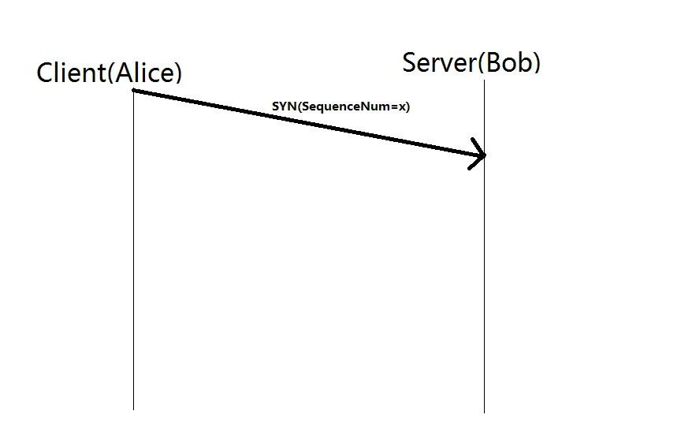
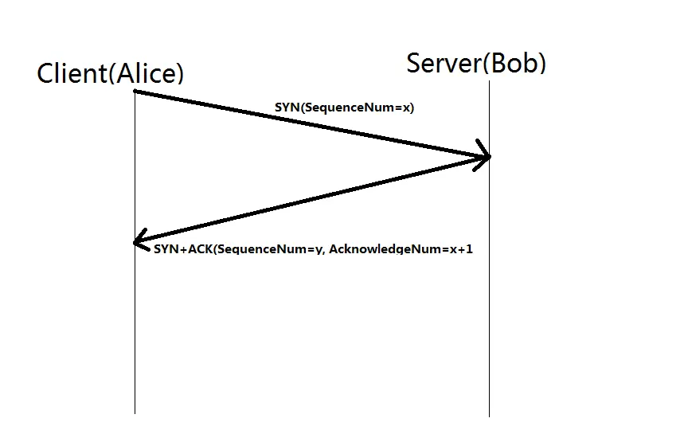
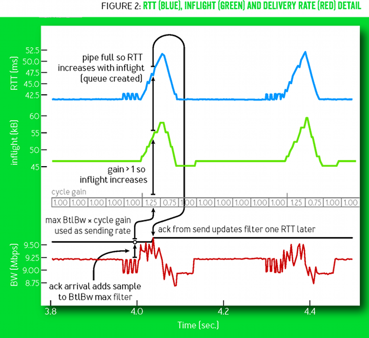
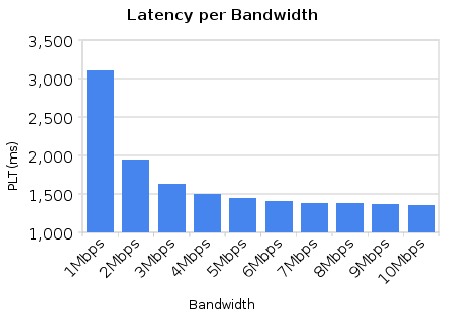
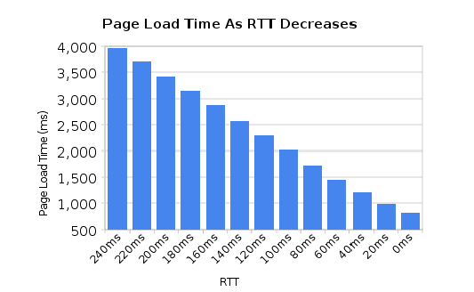
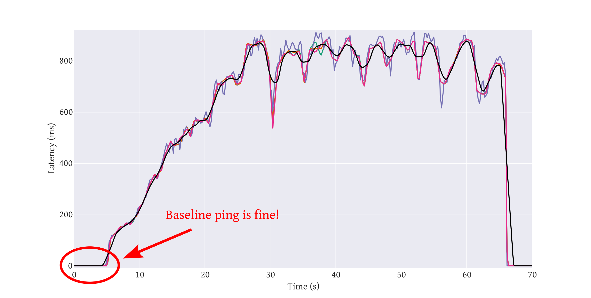
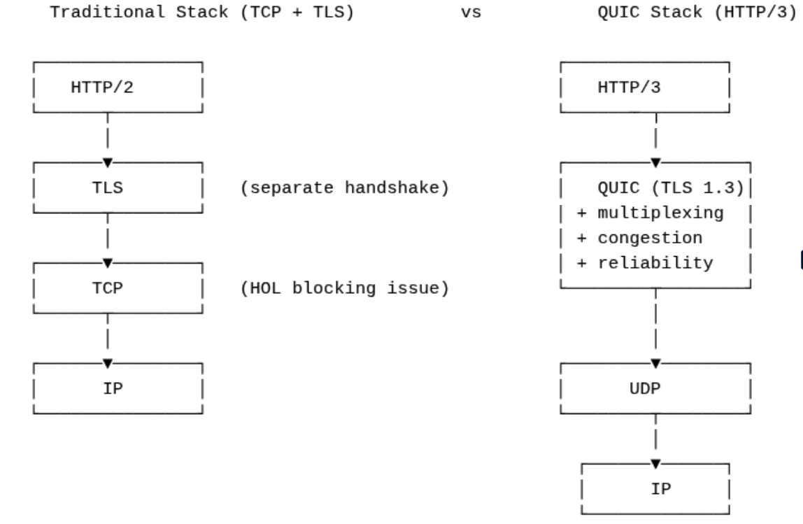

# -*- fill-column: 79; -*-
#+TITLE: Transport protocols and application performance
#+AUTHOR: Toke Høiland-Jørgensen <toke@redhat.com>
#+EMAIL: toke@redhat.com
#+REVEAL_THEME: white
#+REVEAL_TRANS: linear
#+REVEAL_MARGIN: 0
#+REVEAL_ROOT: ../reveal.js
#+REVEAL_EXTRA_CSS: custom.css
#+OPTIONS: reveal_center:t reveal_control:t reveal_history:nil
#+OPTIONS: reveal_width:1600 reveal_height:900 reveal_pdfseparatefragments:nil
#+OPTIONS: ^:nil tags:nil toc:nil num:nil ':t

* Outline / ideas                                                  :noexport:
- Handshake (SYN/SYN-ACK/ACK-sekvens)
- Slow start
- Congestion avoidance
- De mest almindelige congestion control-algoritmer:
        - Reno
        - CUBIC
               - BBR
- Loss recovery-mekanismer:
        - Basis (dup-ack + retransmit timer)
              - SACK
- Interaktion med andre lag:
              - Latency, jitter og bufferbloat
              - Reordering / HOL blocking
- Testværktøjer:
              - Netperf/iperf

* Agenda                                                             :export:

- Connection startup
- Loss recovery mechanisms
- Congestion control
- Interactions with other parts of the network

** TCP conceptually

- Connection oriented
  - Have to =connect()= before transmitting

- Byte stream based
  - Chopping data into packets is a protocol detail

- Reliable
  - Data will (eventually) arrive in order, or error out

- Adaptable
  - Will attempt to transmit data as fast as possible over any link

- Old
  - [[https://www.rfc-editor.org/rfc/rfc675][RFC675]] was first published 51 years ago - lots has happened since!

* Connection startup                                                 :export:

** TCP handshake
:PROPERTIES:
:reveal_extra_attr: class="img-slide"
:END:

#+ATTR_html: :style height: 700px;

** TCP handshake
:PROPERTIES:
:reveal_extra_attr: class="img-slide"
:END:

#+ATTR_html: :style height: 700px;

** TCP handshake
:PROPERTIES:
:reveal_extra_attr: class="img-slide"
:END:

#+CAPTION: Image source: https://en.wikipedia.org/wiki/Handshake_(computing)
#+ATTR_html: :style height: 700px;
[[file:Handshake-3.webp]]

** Adding TLS
:PROPERTIES:
:reveal_extra_attr: class="img-slide"
:END:

#+ATTR_html: :style height: 700px;
#+CAPTION: Image source: https://en.wikipedia.org/wiki/Transport_Layer_Security#TLS_handshake
[[file:Full_TLS_1.2_Handshake.svg]]

** Important points - connection startup

- Small packets
- Multiple round-trips to setup a connection
- Dominated by RTT
- Can take longer than the data transfer!

* TCP loss recovery                                                  :export:

** Retransmission timeout (RTO)
#+ATTR_html: :style height: 700px;

** Fast retransmit (DupACK)

#+ATTR_html: :style height: 700px;
[[file:dupack.svg]]

** Selective Acknowledgement (SACK and DSACK)

- SACK: [[https://datatracker.ietf.org/doc/rfc2018/][RFC2018]]
- DSACK: [[https://datatracker.ietf.org/doc/rfc2883/][RFC2883]]

#+ATTR_html: :style height: 600px;
[[file:sack.svg]]

** Tail Loss Probes (TLP)
#+ATTR_html: :style height: 650px;
[[file:tlp.svg]]

Shorter timeout, don't reduce window

** Recent Acknowledgement (RACK)

- [[https://datatracker.ietf.org/doc/rfc8985/][RFC8985]]
- Keep a "recent window" based on RTT (=rtt_min/4=)
- Don't trigger loss recovery if OOO packets arrive within this window
- Significantly improves behaviour when the network reorders packets

** Important points - loss recovery

- Several different mechanisms in play
- SACK, RACK and TLP improves behaviour
  - Reordering resilience in particular
- Active research and innovation - moving target!

* Congestion control                                                 :export:
Congestion control determine TCP behaviour. We'll cover:

- Classic (Reno) TCP
- CUBIC
- BBR

[[https://en.wikipedia.org/wiki/TCP_congestion_control#Algorithms][Wikipedia has a list of other algorithms]]

** Congestion signals
All congestion control algorithms react to one or more signals:

- Packet loss (duplicate ACKs)
- Timeout (RTO)
- ECN notification
- RTT increases

** "Slow" start in classic (Reno) TCP
:PROPERTIES:
:reveal_extra_attr: class="img-slide"
:END:

#+ATTR_html: :style height: 650px;
#+CAPTION: Image source: =https://commons.wikimedia.org/wiki/File:TCP_Slow-Start_and_Congestion_Avoidance.svg=
[[file:TCP_Slow-Start_and_Congestion_Avoidance.svg]]

Many flows never leave slow start!

** TCP CUBIC window function

#+ATTR_html: :style height: 700px;
#+CAPTION: Image source: https://www.cs.princeton.edu/courses/archive/fall16/cos561/papers/Cubic08.pdf
[[file:cubic-window.png]]

** TCP BBR behaviour
#+ATTR_html: :style height: 700px;
#+CAPTION: Image source: https://queue.acm.org/detail.cfm?id=3022184

** Important points - congestion control

- "Classic" (New) Reno often implicit assumption in literature
- CUBIC actually default, and is more aggressive
- BBR totally different, mainly deployed in the cloud (Google)

* TCP interactions                                                   :export:

** Latency
#+HTML: 

#+ATTR_html: :style width: 100%;

#+ATTR_html: :style width: 100%;

#+HTML: 

Source: https://youtu.be/TNBkxA313kk (from 2011)
#+HTML: 

** Bufferbloat

#+ATTR_html: :style height: 700px;

*** Bufferbloat (cont)

- Loss (or ECN mark) is an important signal for TCP!
- Timely signalling required or TCP will keep scaling up
- Active Queue Management (AQM) and Fairness Queueing (FQ) helps
- Excessive link-layer retries add latency

** Head of line (HOL) blocking

#+ATTR_html: :style height: 650px;
[[file:hol.svg]]

Also happens when 2 is reordered, not lost.

** Important points - TCP interactions

- TCP interacts with other layers in non-obvious ways
- Latency equally import as throughput
- Congestion signalling is important!
  - TCP will fill buffers, leading to bloat
- Hardware offloads and pacing can affect packet sequences

* QUIC                                                               :export:

** What is QUIC?
- QUIC = Quick UDP Internet Connections
- Developed by Google, standardized by IETF ([[https://datatracker.ietf.org/doc/rfc9000/][RFC9000]])
- Runs over UDP (instead of TCP)
- Combines:
  - Transport (similar to TCP)
  - Security (built-in TLS 1.3)
  - Implemented in user-space
- Foundation of HTTP/3 ([[https://datatracker.ietf.org/doc/rfc9114/][RFC9114]])

Key selling point:

QUIC reduces latency and improves reliability compared to TCP + TLS

** Why does QUIC improve performance?
- Faster connection setup
  - 1-RTT (0-RTT on repeat connections)
- No head-of-line blocking
  - Independent streams within a connection
- Built-in encryption
  - No separate TLS handshake
- Connection migration
  - Survives IP changes (e.g., Wi-Fi → mobile)

**                                                                  :export:
:PROPERTIES:
:reveal_extra_attr: class="img-slide"
:END:

* Further reading                                                    :export:
- Wikipedia: https://en.wikipedia.org/wiki/TCP_congestion_control
- Bufferbloat web site: https://bufferbloat.net/
- My own PhD: https://bufferbloat-and-beyond.net/
- "It's the latency, stupid": [[https://www.stuartcheshire.org/rants/Latency.html]]
- RFCs can be very readable (links throughout the presentation)

* Emacs end-tricks                                                 :noexport:

This section contains some emacs tricks, that e.g. remove the "Slide:" prefix
in the compiled version.

# Local Variables:
# org-re-reveal-title-slide: "<h1 class=\"title\">%t</h1> Toke Høiland-Jørgensen - Network Services Team Simone Ferlin-Reiter - Perf & Scale Team"
# org-export-filter-headline-functions: ((lambda (contents backend info) (replace-regexp-in-string "Slide: " "" contents)))
# End:
