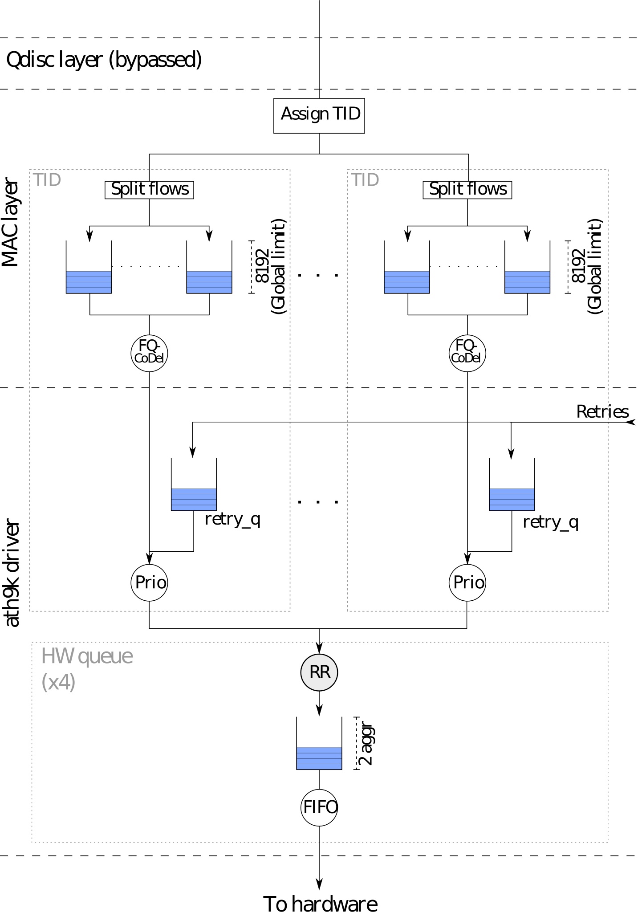
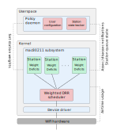
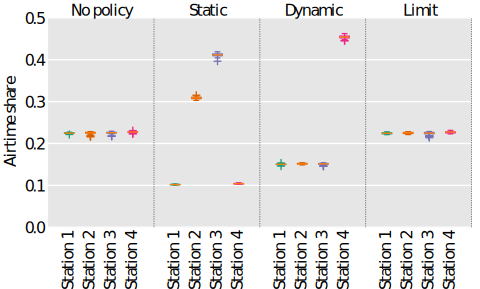
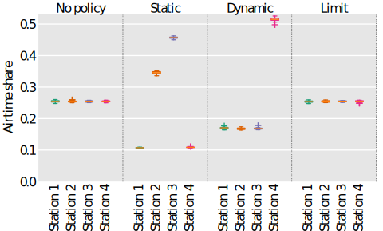
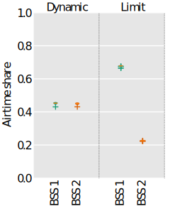
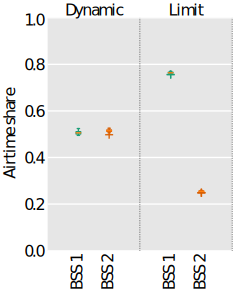
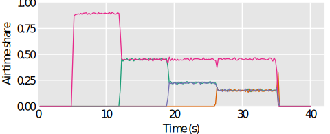
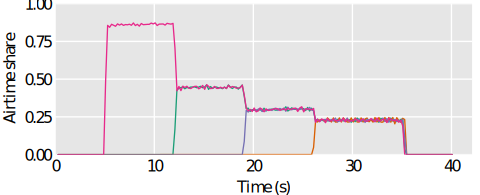
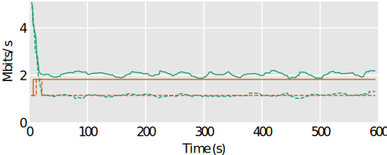

<!-- .slide: class="center" -->
# PoliFi
## Airtime Policy Enforcement for WiFi

&nbsp;

Toke Høiland-Jørgensen

&nbsp;

IAB workshop, 27th September, 2018

---

# Background

- The IEEE 802.11 performance anomaly
- Bufferbloat in WiFi

---

# Background

 <!-- .element class="stretch" -->

---

# Problem statement

 <!-- .element style="height: 500px" -->

---

# Polifi design

 <!-- .element class="stretch" -->

---

# Weight computation

For groups $i \in I$ with group weight $ W_i $ and $N_i$ active stations:

Compute $C = \prod_{i\in I}N_i$.

&nbsp;

Then, the per-station weight is given by:

$W^s_{i} = \frac{W_iC}{N_i}$

---

# Airtime scheduler

 <!-- .element class="stretch" -->

---

# Steady-state results - stations

 <!-- .element style="width: 100%" -->  
UDP

 <!-- .element style="width: 100%" -->  
TCP

---

# Steady-state results - BSSes

 <!-- .element style="width: 80%" -->  
UDP

 <!-- .element style="width: 80%" -->  
TCP

---

# Dynamic measurements

 <!-- .element style="height: 400px" -->

 <!-- .element style="height: 400px" -->

---

# DASH traffic

 <!-- .element style="height: 400px" -->

---

# Conclusion

Polifi:

- Enforces airtime policies on infrastructure WiFi networks
- Makes it possible to express a range of useful policies
- Can improve the performance of a real-world DASH video streaming
- Is in the process of being upstreamed into Linux
